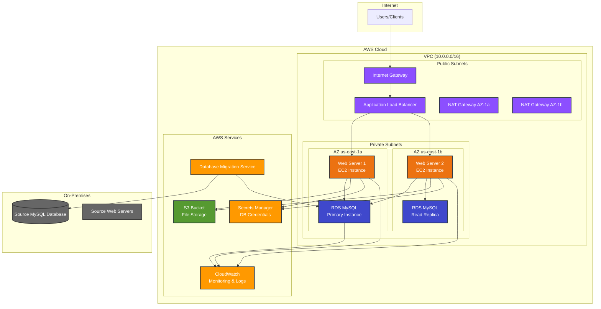

# AWS Lift and Shift Migration Architecture

## High-Level Architecture



## Detailed Network Architecture

```
┌─────────────────────────────────────────────────────────────────────────────────┐
│                                AWS VPC (10.0.0.0/16)                           │
├─────────────────────────────────────────────────────────────────────────────────┤
│                                                                                 │
│  ┌─────────────────────────┐              ┌─────────────────────────┐          │
│  │    Public Subnet 1      │              │    Public Subnet 2      │          │
│  │    (10.0.1.0/24)        │              │    (10.0.2.0/24)        │          │
│  │    AZ: us-east-1a       │              │    AZ: us-east-1b       │          │
│  │                         │              │                         │          │
│  │  ┌─────────────────┐    │              │  ┌─────────────────┐    │          │
│  │  │       ALB       │    │              │  │   NAT Gateway   │    │          │
│  │  │   (Primary)     │    │              │  │                 │    │          │
│  │  └─────────────────┘    │              │  └─────────────────┘    │          │
│  │                         │              │                         │          │
│  │  ┌─────────────────┐    │              │                         │          │
│  │  │   NAT Gateway   │    │              │                         │          │
│  │  │                 │    │              │                         │          │
│  │  └─────────────────┘    │              │                         │          │
│  └─────────────────────────┘              └─────────────────────────┘          │
│                                                                                 │
│  ┌─────────────────────────┐              ┌─────────────────────────┐          │
│  │   Private Subnet 1      │              │   Private Subnet 2      │          │
│  │    (10.0.3.0/24)        │              │    (10.0.4.0/24)        │          │
│  │    AZ: us-east-1a       │              │    AZ: us-east-1b       │          │
│  │                         │              │                         │          │
│  │  ┌─────────────────┐    │              │  ┌─────────────────┐    │          │
│  │  │   Web Server 1  │    │              │  │   Web Server 2  │    │          │
│  │  │   EC2 Instance  │    │              │  │   EC2 Instance  │    │          │
│  │  └─────────────────┘    │              │  └─────────────────┘    │          │
│  │                         │              │                         │          │
│  │  ┌─────────────────┐    │              │  ┌─────────────────┐    │          │
│  │  │  RDS Primary    │    │              │  │  RDS Replica    │    │          │
│  │  │  MySQL 8.0      │    │              │  │  MySQL 8.0      │    │          │
│  │  └─────────────────┘    │              │  └─────────────────┘    │          │
│  └─────────────────────────┘              └─────────────────────────┘          │
│                                                                                 │
└─────────────────────────────────────────────────────────────────────────────────┘

┌─────────────────────────────────────────────────────────────────────────────────┐
│                              AWS Managed Services                               │
├─────────────────────────────────────────────────────────────────────────────────┤
│                                                                                 │
│  ┌─────────────┐  ┌─────────────┐  ┌─────────────┐  ┌─────────────┐           │
│  │     S3      │  │  Secrets    │  │ CloudWatch  │  │     DMS     │           │
│  │   Bucket    │  │  Manager    │  │ Monitoring  │  │ Migration   │           │
│  │             │  │             │  │             │  │   Service   │           │
│  └─────────────┘  └─────────────┘  └─────────────┘  └─────────────┘           │
│                                                                                 │
└─────────────────────────────────────────────────────────────────────────────────┘
```

## Migration Flow

```
┌─────────────────┐    Migration    ┌─────────────────┐
│  On-Premises    │    Services     │   AWS Cloud     │
│                 │                 │                 │
│  ┌───────────┐  │                 │  ┌───────────┐  │
│  │MySQL DB   │  │ ──── DMS ────► │  │RDS MySQL  │  │
│  │           │  │                 │  │           │  │
│  └───────────┘  │                 │  └───────────┘  │
│                 │                 │                 │
│  ┌───────────┐  │                 │  ┌───────────┐  │
│  │Web Servers│  │ ──── MGN ────► │  │EC2 Instances│ │
│  │           │  │                 │  │           │  │
│  └───────────┘  │                 │  └───────────┘  │
│                 │                 │                 │
│  ┌───────────┐  │                 │  ┌───────────┐  │
│  │File Storage│  │ ── Manual ───► │  │S3 Bucket  │  │
│  │           │  │                 │  │           │  │
│  └───────────┘  │                 │  └───────────┘  │
└─────────────────┘                 └─────────────────┘
```

## Security Architecture

```
┌─────────────────────────────────────────────────────────────────────────────────┐
│                              Security Layers                                    │
├─────────────────────────────────────────────────────────────────────────────────┤
│                                                                                 │
│  Internet ──► WAF ──► ALB ──► Security Groups ──► EC2 Instances                │
│                │       │                                                       │
│                │       └──► SSL/TLS Termination                               │
│                │                                                               │
│                └──► DDoS Protection                                            │
│                                                                                 │
│  ┌─────────────────────────────────────────────────────────────────────────┐   │
│  │                        Network Security                                 │   │
│  │                                                                         │   │
│  │  • VPC with private subnets for databases                             │   │
│  │  • Security Groups (stateful firewall)                                │   │
│  │  • NACLs (network-level access control)                               │   │
│  │  • VPC Flow Logs for monitoring                                       │   │
│  │  • Private connectivity to AWS services                               │   │
│  └─────────────────────────────────────────────────────────────────────────┘   │
│                                                                                 │
│  ┌─────────────────────────────────────────────────────────────────────────┐   │
│  │                        Data Security                                    │   │
│  │                                                                         │   │
│  │  • RDS encryption at rest (AES-256)                                   │   │
│  │  • S3 encryption at rest                                              │   │
│  │  • SSL/TLS encryption in transit                                      │   │
│  │  • Secrets Manager for credentials                                    │   │
│  │  • IAM roles with least privilege                                     │   │
│  └─────────────────────────────────────────────────────────────────────────┘   │
│                                                                                 │
└─────────────────────────────────────────────────────────────────────────────────┘
```

## Component Details

### Compute Layer
- **EC2 Instances**: t3.medium instances running Amazon Linux 2023
- **Auto Scaling**: Configurable ASG for high availability
- **Load Balancer**: Application Load Balancer with health checks

### Database Layer
- **RDS MySQL**: Multi-AZ deployment for high availability
- **Read Replicas**: For read scaling and disaster recovery
- **Automated Backups**: 7-day retention with point-in-time recovery

### Storage Layer
- **S3 Bucket**: Object storage for application files
- **Lifecycle Policies**: Automatic transition to cheaper storage classes
- **Versioning**: Enabled for data protection

### Network Layer
- **VPC**: Isolated network environment
- **Subnets**: Public for load balancers, private for applications
- **NAT Gateways**: Outbound internet access for private subnets
- **Security Groups**: Application-level firewall rules

### Monitoring Layer
- **CloudWatch**: Metrics, logs, and alarms
- **Custom Dashboards**: Application performance monitoring
- **SNS Notifications**: Alert notifications via email/SMS

### Migration Services
- **DMS**: Database migration with minimal downtime
- **MGN**: Server migration service
- **Secrets Manager**: Secure credential storage

## Scalability Features

### Horizontal Scaling
- Auto Scaling Groups for EC2 instances
- Application Load Balancer for traffic distribution
- RDS Read Replicas for database read scaling

### Vertical Scaling
- Easy instance type changes
- RDS instance class modifications
- Storage auto-scaling

### Geographic Scaling
- Multi-AZ deployment for high availability
- Cross-region replication capabilities
- CloudFront CDN integration ready

## Disaster Recovery

### Backup Strategy
- RDS automated backups with 7-day retention
- S3 versioning and cross-region replication
- Infrastructure as Code for rapid rebuilding

### Recovery Objectives
- **RTO (Recovery Time Objective)**: < 4 hours
- **RPO (Recovery Point Objective)**: < 15 minutes
- **Availability Target**: 99.9% uptime

This architecture provides a robust, scalable, and secure foundation for migrating traditional web applications to AWS cloud infrastructure.